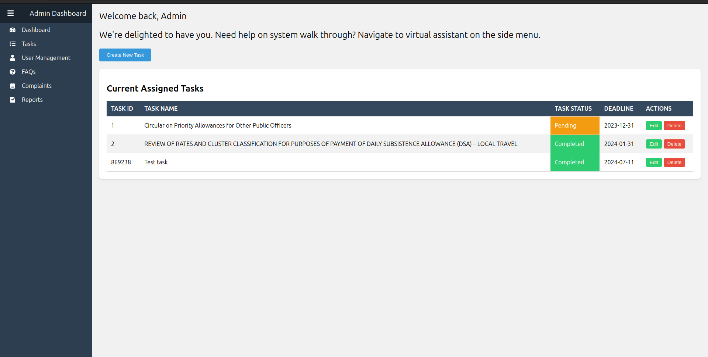

# Project Management System

This project is a comprehensive Project Management System designed for administrative use, offering functionalities such as task management, user management, and complaint handling. The system includes a responsive sidebar and top bar navigation to ensure a seamless user experience.

## Table of Contents

- [Demo](#demo)
- [Features](#features)
- [Technologies Used](#technologies-used)
- [Installation](#installation)
- [Usage](#usage)
- [File Structure](#file-structure)
- [Contributing](#contributing)
- [License](#license)
- [Contact](#contact)

## Demo



## Features

- **Responsive Sidebar Navigation**: Collapsible sidebar with icons and text.
- **Task Management**: Create, update, and delete tasks with status indicators.
- **User Management**: Manage users, including adding and editing user information.
- **Complaint Handling**: Submit and view complaints with status updates.
- **Top Bar Navigation**: Includes user dropdown and navigation toggle button.
- **Local Storage**: Saves tasks and users in local storage for persistence.

## Technologies Used

- **React**: Front-end library for building user interfaces.
- **Styled-Components**: For component-level styling.
- **React Router**: For routing and navigation.
- **React Icons**: For adding icons to the UI.
- **Express**: Backend framework for Node.js.
- **Nodemon**: Utility for automatically restarting the node application when file changes are detected.

## Installation

Follow these steps to set up the project locally:

### Backend Setup

1. **Navigate to the backend directory**:
    ```sh
    cd backend
    ```

2. **Install dependencies**:
    ```sh
    npm install
    ```

### Frontend Setup

1. **Navigate to the frontend directory**:
    ```sh
    cd ../
    ```

2. **Install dependencies**:
    ```sh
    npm install
    ```

## Usage

### Running the Backend

To start the backend server, use the following command:

```sh
cd backend
npm run dev
This will start the backend server with Nodemon on http://localhost:5000.

Running the Frontend
To start the frontend development server, use the following command:

sh
Copy code
cd ../
npm start
This will start the frontend development server and open the project in your default web browser. You can access the project at http://localhost:3000.

File Structure
lua
Copy code
project-management-using-crm/
├── backend/
│   ├── node_modules/
│   ├── tasks.json
│   ├── users.json
│   ├── server.js
│   ├── package-lock.json
│   ├── package.json
├── node_modules/
├── public/
│   ├── index.html
│   └── ...
├── src/
│   ├── components/
│   │   ├── AdminLogin.js
│   │   ├── ComplaintDetails.js
│   │   ├── ComplaintForm.js
│   │   ├── ComplaintList.js
│   │   ├── OfficerLogin.js
│   │   ├── ProtectedRoute.js
│   │   ├── Sidebar.js
│   │   ├── Signup.js
│   │   ├── TaskForm.js
│   │   ├── TaskList.js
│   │   ├── UserForm.js
│   ├── pages/
│   │   ├── AdminDashboard.js
│   │   ├── ComplaintsPage.js
│   │   ├── OfficerDashboard.js
│   │   ├── TaskManagementPage.js
│   │   ├── UserManagement.js
│   ├── App.css
│   ├── App.js
│   ├── App.test.js
│   ├── index.css
│   ├── index.js
│   ├── logo.svg
│   ├── reportWebVitals.js
│   ├── setupTests.js
│   ├── tasks.json
│   ├── users.json
├── .gitignore
├── image.png
├── package-lock.json
├── package.json
├── postcss.config.js
├── README.md
├── tailwind.config.js
Contributing
We welcome contributions to enhance the project. To contribute, follow these steps:

Fork the repository.
Create a new branch:
sh
Copy code
git checkout -b feature-branch
Make your changes and commit them:
sh
Copy code
git commit -m "Add new feature"
Push to the branch:
sh
Copy code
git push origin feature-branch
Create a pull request.
License
This project is licensed under the MIT License. See the LICENSE file for more details.

Contact
For any inquiries or feedback, feel free to contact us:

Email: your.email@example.com - HIDDEN
GitHub: yourusername - HIDDEN# CRM-Project
